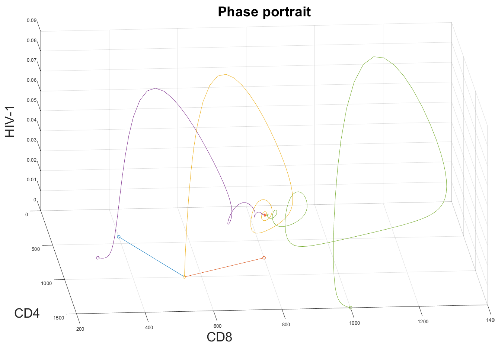

# Analysis and control of a biodynamical model of HIV-1
This is the technical project for the *Dynamics and Nonlinear Control* exam, at University Federico II of Naples.



## Introduction
The aim of this project is to analyze a biodynamical **nonlinear model** describing an HIV-1 infection, as well as develop and compare different control strategies in order to nullify the patient's viral load.

In particular, the mathematical model is derived starting from common knowledge about the HIV-1 infection, and interaction of the viral cells with the human lymphocytes.
Equilibria and stability of the model are analyzed through Lyapunov theory, and possible bifurcations are considered.
Finally, three different control schemes are developed (linear control, feedback linearization control, adaptive control) and the obtainable performances are evaluated and compared.

The system and the control schemes are modeled and developed using *MATLAB* and *SIMULINK* frameworks.


## Download and compile
In order to execute the content of this repository, you need both *MATLAB* and *SIMULINK*, but no other specialized package are needed.

Notice that the bifurcations diagram, saved as .fig files, have been obtained using the `matcont` package. For further information about this software, [read here](https://dercole.faculty.polimi.it/tds/matcont.html).

Just clone the repository using the following command:
```
    $ git clone https://github.com/micmarolla/HIV_model_control
```
and open the file `code/main.m`.


## Execute the code
In order to play the provided scene, 
open the file `main.m` in *MATLAB*.

You can comment / uncomment rows `50 - 70` and select which scripts and models you want to execute.

In the following, all the scripts are presented and explained.

 - `phase_port` computes and shows the phase portrait of the system, starting from different initial conditions
 - `sim_a_neg` executes just one simulation in the (unrealistic) case the patient's immunitary system is able to successfully eradicate the viral load
 - `linear_control`  proposes a simple proportional control, simulates the systems and analyzes its performances
 - `fbl` proposes a feedback linearization control
 - `ad_fbl` proposes an adaptive control
 - `comparison`, finally compare the performances of the three control schemes.

By default, only `phase_port` and `comparison` scripts are enabled.

After you have uncommented the desired scripts, you're ready to go. Just execute `main.m`.

## In detail documentation
In the doc folder you can find [a detailed report](doc/Report.pdf)
of the project.
